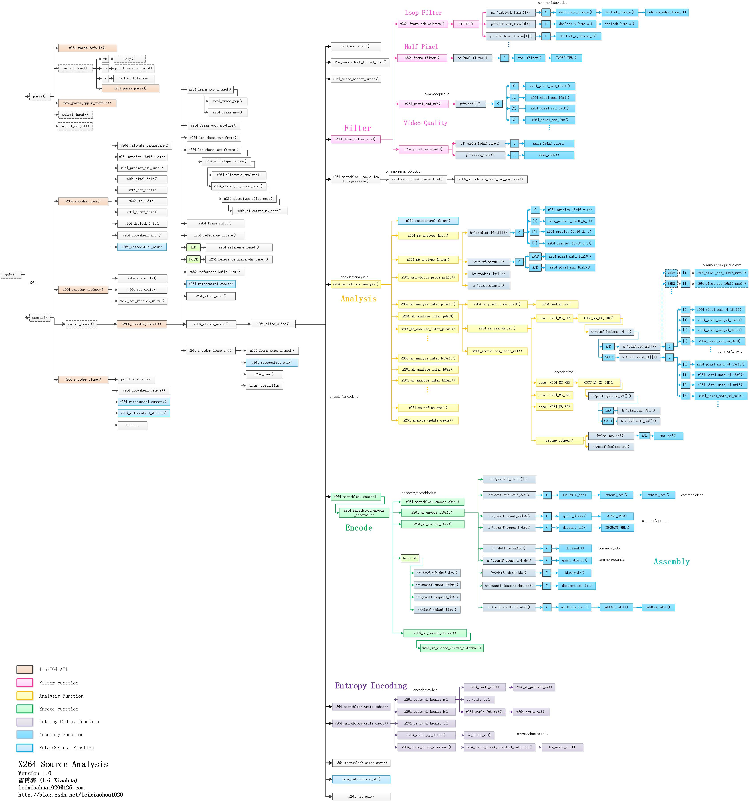

二进制下载地址：https://download.videolan.org/pub/videolan/x264/binaries/

源码下载：git clone https://code.videolan.org/videolan/x264.git


X264函数调用关系：




**函数背景色**：函数在图中以方框的形式表现出来。不同的背景色标志了该函数不同的作用：
白色背景的函数：不加区分的普通内部函数。
浅棕背景的函数：libx264类库的接口函数（API）。
粉红色背景函数：滤波函数（Filter）。用于环路滤波，半像素插值，SSIM/PSNR的计算。
黄色背景函数：分析函数（Analysis）。用于帧内预测模式的判断，或者帧间预测模式的判断。
绿色背景的函数：宏块编码函数（Encode）。通过对残差的DCT变换、量化等方式对宏块进行编码。
紫色背景的函数：熵编码函数（Entropy Coding）。对宏块编码后的数据进行CABAC或者CAVLC熵编码。
蓝色背景函数：汇编函数（Assembly）。做过汇编优化的函数。图中主要画出了这些函数的C语言版本，此外这些函数还包含MMX版本、SSE版本、NEON版本等。
浅蓝色背景函数：码率控制函数（Rate Control）。对码率进行控制的函数。具体的方法包括了ABR、CBR、CRF等。

**区域**

整个关系图可以分为以下几个区域：
最左边区域——x264命令行程序函数区域。
左边中间区域——libx264内部函数区域。
右上方粉红色区域——滤波模块。其中包括了环路滤波，半像素插值，SSIM/PSNR计算。
右上方黄色区域——分析模块。其中包含了帧内预测模式分析以及帧间运动估计等。
右中间绿色区域——宏块编码模块。其中包含了针对编码帧的DCT变换，量化，Hadamard变换等；以及针对重建帧的DCT反变换，反量化，Hadamard反变换等。
右下方紫色区域——熵编码模块。其中包含了CABAC或者CAVLC熵编码。

**箭头线**
箭头线标志了函数的调用关系：

黑色箭头线：不加区别的调用关系。
粉红色的箭头线：滤波函数（Filter）之间的调用关系。
黄色箭头线：分析函数（Analysis）之间的调用关系。
绿色箭头线：宏块编码函数（Encode）之间的调用关系。
紫色箭头线：熵编码函数（Entropy Coding）之间的调用关系。

**函数所在的文件**
每个函数标识了它所在的文件路径。


### X264核心API

```c++
在一个x264编码流程中，至少需要调用如下API函数（参考文章《 最简单的视频编码器：基于libx264（编码YUV为H.264）》）：
x264_param_default()：设置参数集结构体x264_param_t的缺省值。
x264_picture_alloc()：为图像结构体x264_picture_t分配内存。
x264_encoder_open()：打开编码器。
x264_encoder_encode()：编码一帧图像。
x264_encoder_close()：关闭编码器。
x264_picture_clean()：释放x264_picture_alloc()申请的资源。
```

**执行`x264_slice_write` 之前的函数：**

**x264_encoder_open()**调用了下面的函数：

```c++
x264_validate_parameters()：检查输入参数（例如输入图像的宽高是否为正数）。
x264_predict_16x16_init()：初始化Intra16x16帧内预测汇编函数。
x264_predict_4x4_init()：初始化Intra4x4帧内预测汇编函数。
x264_pixel_init()：初始化像素值计算相关的汇编函数（包括SAD、SATD、SSD等）。
x264_dct_init()：初始化DCT变换和DCT反变换相关的汇编函数。
x264_mc_init()：初始化运动补偿相关的汇编函数。
x264_quant_init()：初始化量化和反量化相关的汇编函数。
x264_deblock_init()：初始化去块效应滤波器相关的汇编函数。
x264_lookahead_init()：初始化Lookahead相关的变量。
x264_ratecontrol_new()：初始化码率控制模块。
```

**x264_encoder_headers()**调用了下面的函数：

```c++
x264_sps_write()：输出SPS
x264_pps_write()：输出PPS
x264_sei_version_write()：输出SEI
```

**x264_encoder_encode()**调用了下面的函数：

```c++
x264_frame_pop_unused()：//获取1个x264_frame_t类型结构体fenc。如果frames.unused[]队列不为空，就调用x264_frame_pop()从unused[]队列取1个现成的；否则就调用x264_frame_new()创建一个新的。
x264_frame_copy_picture()：//将输入的图像数据拷贝至fenc。
x264_lookahead_put_frame()：//将fenc放入lookahead.next.list[]队列，等待确定帧类型。
x264_lookahead_get_frames()：//通过lookahead分析帧类型。该函数调用了x264_slicetype_decide()，x264_slicetype_analyse()和x264_slicetype_frame_cost()等函数。经过一些列分析之后，最终确定了帧类型信息，并且将帧放入frames.current[]队列。
x264_frame_shift()：//从frames.current[]队列取出一帧用于编码。
x264_reference_update()：//更新参考帧列表。
x264_reference_reset()：//如果为IDR帧，调用该函数清空参考帧列表。
x264_reference_hierarchy_reset()：//如果是I（非IDR帧）、P帧、B帧（可做为参考帧），调用该函数（还没研究）。
x264_reference_build_list()：//创建参考帧列表list0和list1。
x264_ratecontrol_start()：//开启码率控制。
x264_slice_init()：//创建 Slice Header。
x264_slices_write()：//编码数据（最关键的步骤）。其中调用了x264_slice_write()完成了编码的工作（注意“x264_slices_write()”和“x264_slice_write()”名字差了一个“s”）。
x264_encoder_frame_end()：//编码结束后做一些后续处理，例如释放一些中间变量以及打印输出一些统计信息。其中调用了x264_frame_push_unused()将fenc重新放回frames.unused[]队列，并且调用x264_ratecontrol_end()关闭码率控制。
```

## x264_slice_write()

x264_slice_write()用于编码Slice。该函数中包含了一个很长的for()循环。该循环每执行一遍编码一个宏块。

x264_slice_write()中以下几个函数比较重要：

```
x264_nal_start()：开始写一个NALU。
x264_macroblock_thread_init()：初始化存储宏块的重建数据缓存fdec_buf[]和编码数据缓存fenc_buf[]。
x264_slice_header_write()：输出 Slice Header。
x264_fdec_filter_row()：滤波模块。该模块包含了环路滤波，半像素插值，SSIM/PSNR的计算。
x264_macroblock_cache_load()：将要编码的宏块的周围的宏块的信息读进来。
x264_macroblock_analyse()：分析模块。该模块包含了帧内预测模式分析以及帧间运动估计等。
x264_macroblock_encode()：宏块编码模块。该模块通过对残差的DCT变换、量化等方式对宏块进行编码。
x264_macroblock_write_cabac()：CABAC熵编码模块。
x264_macroblock_write_cavlc()：CAVLC熵编码模块。
x264_macroblock_cache_save()：保存当前宏块的信息。
x264_ratecontrol_mb()：码率控制。
x264_nal_end()：结束写一个NALU。
```

## 滤波模块

滤波模块对应的函数是x264_fdec_filter_row()。该函数完成了环路滤波，半像素插值，SSIM/PSNR的计算的功能。该函数调用了以下及个比较重要的函数：

```c++
x264_frame_deblock_row()：去块效应滤波器。
x264_frame_filter()：半像素插值。
x264_pixel_ssd_wxh()：PSNR计算。
x264_pixel_ssim_wxh()：SSIM计算。
```

## 分析模块

分析模块对应的函数是x264_macroblock_analyse()。该函数包含了帧内预测模式分析以及帧间运动估计等。该函数调用了以下比较重要的函数（只列举了几个有代表性的函数）：

```c++
x264_mb_analyse_init()：Analysis模块初始化。
x264_mb_analyse_intra()：I宏块帧内预测模式分析。
x264_macroblock_probe_pskip()：分析是否是skip模式。
x264_mb_analyse_inter_p16x16()：P16x16宏块帧间预测模式分析。
x264_mb_analyse_inter_p8x8()：P8x8宏块帧间预测模式分析。
x264_mb_analyse_inter_p16x8()：P16x8宏块帧间预测模式分析。
x264_mb_analyse_inter_b16x16()：B16x16宏块帧间预测模式分析。
x264_mb_analyse_inter_b8x8()：B8x8宏块帧间预测模式分析。
x264_mb_analyse_inter_b16x8()：B16x8宏块帧间预测模式分析。
```

## 宏块编码模块

宏块编码模块对应的函数是x264_macroblock_encode()。该模块通过对残差的DCT变换、量化等方式对宏块进行编码。对于Intra16x16宏块，调用x264_mb_encode_i16x16()进行编码，对于Intra4x4，调用x264_mb_encode_i4x4()进行编码。对于Inter类型的宏块则直接在函数体里面编码。

## 熵编码模块

CABAC熵编码对应的函数是x264_macroblock_write_cabac()。CAVLC熵编码对应的函数是x264_macroblock_write_cavlc()。x264_macroblock_write_cavlc()调用了以下几个比较重要的函数：

```c++
x264_cavlc_mb_header_i()：写入I宏块MB Header数据。包含帧内预测模式等。
x264_cavlc_mb_header_p()：写入P宏块MB Header数据。包含MVD、参考帧序号等。
x264_cavlc_mb_header_b()：写入B宏块MB Header数据。包含MVD、参考帧序号等。
x264_cavlc_qp_delta()：写入QP。
x264_cavlc_block_residual()：写入残差数据。
```

## 码率控制模块

码率控制模块函数分布在x264源代码不同的地方，包含了以下几个比较重要的函数：

```c++
x264_encoder_open()中的x264_ratecontrol_new()：创建码率控制。
x264_encoder_encode()中的x264_ratecontrol_start()：开始码率控制。
x264_slice_write()中的x264_ratecontrol_mb()：码率控制算法。
x264_encoder_encode()中的x264_ratecontrol_end()：结束码率控制。
x264_encoder_close()中的x264_ratecontrol_summary()：码率控制信息。
x264_encoder_close()中的x264_ratecontrol_delete()：释放码率控制。
```

至此x264的源代码概述就基本完成了，后续几篇文章详细记录其内部的源代码。