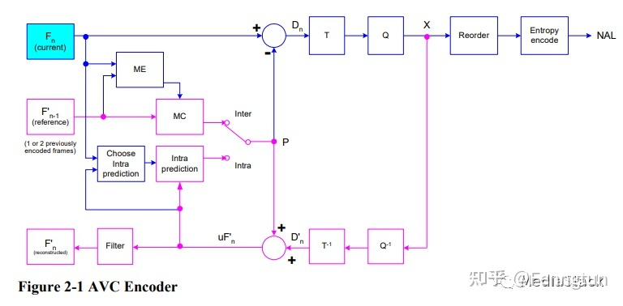

视频编码发展历程：

1. H.265/HEVC：压缩率高，但算法运算复杂度更高；专利许可更严苛；

2. AVS/AVS+/AVS2：市场认可度不高，仅在部分广电系统内应用；

3. MPEG-2：编码性能已经落后，不能满足当前高清、超高清视频的需求；

4. VP8/VP9：由 Google 牵头开发，目前仅在 YouTube 等 Google 旗下视频企业使用；

H.264 是自 MPEG-2 在 DVD 和数字电视广播等领域取得巨大成功后，ITU-T与MPEG合作产生又一重要成果。H.264 标准是属于MPEG-4家族的一部分，即 MPEG-4 系列文档 ISO-14496 的第 10 部分，因此又称作 MPEG-4/AVC。同MPEG-4重点考虑的灵活性和交互性不同，H.264着重强调更高的编码压缩率和传输可靠性，在数字电视广播、实时视频通信、网络流媒体等领域具有广泛的应用。

H264 编码框架：

ME（motion estimate）：运动估计
MC（motion compensation）：运动补偿

在 H.264 进行编码的过程中，每一帧的H图像被分为一个或多个**条带(slice)** 进行编码。每一个条带包含多个**宏块(MB,Macroblock)**。宏块是 H.264 标准中基本的编码单元，其基本结构包含一个包含 16×16 个亮度像素块和两个 8×8 色度像素块，以及其他一些宏块头信息。在对一个宏块进行编码时，每一个宏块会分割成多种不同大小的子块进行预测。**帧内预测采用的块大小可能为 16×16 或者 4×4**，**帧间预测/运动补偿采用的块可能有7种不同的形状：16×16、16×8、8×16、8×8、8×4、4×8和4×4。**相比于早期标准只能按照宏块或者半个宏块进行运动补偿，H.264 所采用的这种更加细分的宏块分割方法提供了更高的预测精度和编码效率。在变换编码方面，针对预测残差数据进行的变换块大小为 4×4 或 8×8。相比于仅支持8×8大小的变换块的早期版本，H.264 避免了变换逆变换中经常出现的失配问题。

H.264标准中采用的熵编码方法主要有上下文自适应的变长编码 CAVLC 和上下文自适应的二进制算数编码 CABAC，根据不同的语法元素类型指定不同的编码方式。通过这两种熵编码方式达到一种编码效率与运算复杂度之间的平衡。

同前期标准类似，H.264 的条带也具有不同的类型，其中最常用的有I条带、P条带和B条带等。另外，为了支持码流切换，在扩展档次中还定义了 SI 和 SP 片。

- I条带：帧内编码条带，只包含I宏块；
- P条带：单向帧间编码条带，可能包含P宏块和I宏块；
- B条带：双向帧间编码条带，可能包含B宏块和I宏块；

视频编码中采用的如预测编码、变化量化、熵编码等编码工具主要工作在slice层或以下，这一层通常被称为 **“视频编码层”(Video Coding Layer, VCL)**。相对的，在slice以上所进行的数据和算法通常称之为 **“网络抽象层”(Network Abstraction Layer, NAL)**。设计定义NAL层的主要意义在于提升H.264格式的视频对网络传输和数据存储的亲和性。

为了适应不同的应用场景，H.264 也定义了多种不同的档次：

- 基准档次(Baseline Profile)：主要用于视频会议、可视电话等低延时实时通信领域；支持 I 条带和 P 条带，熵编码支持 CAVLC 算法。
- 主要档次(Main Profile)：主要用于数字电视广播、数字视频数据存储等；支持视频场编码、B条带双向预测和加权预测，熵编码支持 CAVLC 和 CABAC 算法。
- 扩展档次(Extended Profile)：主要用于网络视频直播与点播等；支持基准档次的所有特性，并支持 SI 和 SP 条带，支持数据分割以改进误码性能，支持 B 条带和加权预测，但不支持 CABAC 和场编码。
- 高档次(High Profile)：适用于高压缩率和型能场景；支持 Main Profile 的所有特性，以及 8×8 帧内预测、自定义量化、无损压缩格式以及更多的 YUV 采样格式等。

目前比较知名的 H.264 编码器实现主要有：

1. x264：应用最广泛的 H.264 软件编码器；
2. JM：H.264 标准工作组维护的算法标准参考软件；
3. openH264：由思科公司开发的采用 BSD 协议的开源 H.264 编解码器；
4. 其他实现：MainConcept/QuickTime/Elecard 等

H264 解码框架：

