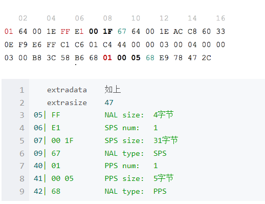
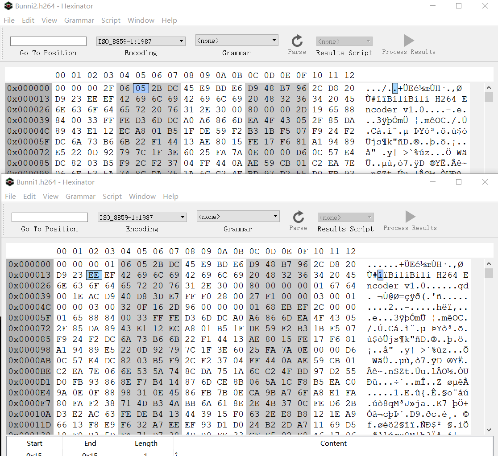

## 一：AnnexB与AVCC格式的选择

### AnnexB格式

**[start code]NALU | [start code] NALU |...**
这种格式比较常见，也就是我们熟悉的每个帧前面都有0x00 00 00 01或者0x00 00 01作为起始码。.h264文件就是采用的这种格式，每个帧前面都要有个起始码。SPS PPS等也作为一类NALU存储在这个码流中，一般在码流最前面。也就是说这种格式包含VCL 和 非VCL 类型的NALU。

### AVCC格式

**([extradata]) | ([length] NALU) | ([length] NALU) | ...**这种模式也叫AVC1格式，没有起始码，每个帧最前面几个字节（通常4字节）是帧长度。这里的NALU一般没有SPS PPS等参数信息，参数信息属于额外数据extradata存在其他地方。比如ffmpeg中解析mp4文件后sps pps存在streams[index]->codecpar->extradata中。也就是说这种码流通常只包含VCL类型NALU。在一路采用 avcC 打包的 H.264 流之中，我们首先看到的将是一段被称之为 extradata 的数据，这段数据定义了这个 H.264 流的基本属性数据，当然，也包含了 SPS 和 PPS 数据。`AVCDecoderConfigurationRecord`结构：（最小长度7字节）


我们来看一下 extradata 数据格式，我们注意一下这个值 NALULengthSizeMinusOne，通过将这个值加 1 ，我们就得出了后续每个 NALU 前面前缀（也就是表示长度的整数）的字节数。例如，这个 NALULengthSizeMinusOne 是 3，那么每个 NALU 前面前缀的长度就是 4 个字节。我们在读取后续数据时，可以先读 4 个字节，然后把这四个字节转成整数，就是这个 NALU 的长度了，注意，这个长度并不包含起始的4个字节，是单纯 NALU 的长度

```c++
bits      
8   version ( always 0x01 )  
8   avc profile ( sps[0][1] )  
8   avc compatibility ( sps[0][2] )  
8   avc level ( sps[0][3] )  
6   reserved (all bits on)
2   NALULengthSizeMinusOne // 表示NAL Size。是NAL Size-1。如果NAL Size为4字节，则该2位为11.
3   reserved ( all bits on )  
5   number of SPS NALUs (usually 1)  
       repeated once per SPS: [16位  SPS size]  [SPS NALU data]
8   number of PPS NALUs (usually 1)  
       repeated once per PPS [16位 PPS size][PPS NALU data]
```

avcc extradata实例：根据上面格式一一解析即可




实例对比：上面是avcc下面是annexB格式




**问题1： x264编码默认生成是AVCC格式还是annexb格式？ **

* 经过试验，默认为annexb格式（即`b_annexb`默认为true）

* x264编码参数 `b_annexb` 为true打开Annexb格式的码流，即在每个NAL前加入起始码，

* x264编码参数 `b_annexb` 为false，则关闭Annexb格式的码流，将起始码变为该NAL部分的长度。
* **播放器只能播放annexb格式的码流，关闭b_annexb且确保sps pps有写入，使用ffplay与vlc播放器均无法播放**

如下是annexb与avcc格式的对比。


代码：


### FFmpeg获取mp4中的h264默认码流格式是什么？

​	一般来讲mp4、flv、mkv中直接获取到的h264数据是以AVCC格式存储的。而rtmp码流是以 annexb格式存储的。

指定获取annexB码流 fmpeg -i guid.mp4 -vcodec copy -an -bsf:v h264_mp4toannexb guid2.h264 

**不指定h264_mp4toannexb 时输出的码流格式和ffmpeg版本有关**

**ffmpeg -i guid.mp4 -vcodec copy -an guid.h264  **

同一个mp4文件， libavcodec57 使用上述命令自动转为annexb输出，libavcodec56输出为avcc格式。

指定数据avcc格式，对于ts格式使用如上命令输出的码流仍然后avcc格式。

```
ffmpeg -y -i Big_Buck_Bunny_360_10s_1MB.mp4 -vcodec copy -f m4v Bunni2.h264 
```


### 播放器无法播放的几种h264码流。

* avcc码流几乎所有的播放器都无法播放

* annexb格式经过测试有部分格式有些播放器无法播放。

  * 如从ts格式中提取annexb码流后，其很多NALU之前存在AUD（nalu type =9 表示分割，为pes数据与nalu数据分割后直接放入anneb格式中，属于无效数据）。 使用fflay，potplayer播放正常，使用vlc播放失败。

  