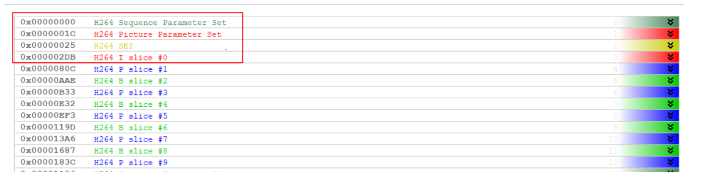
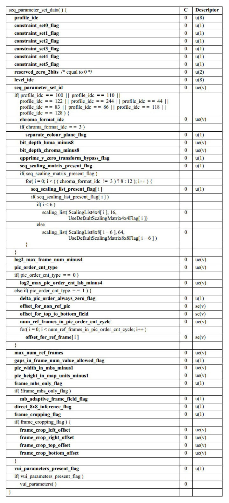
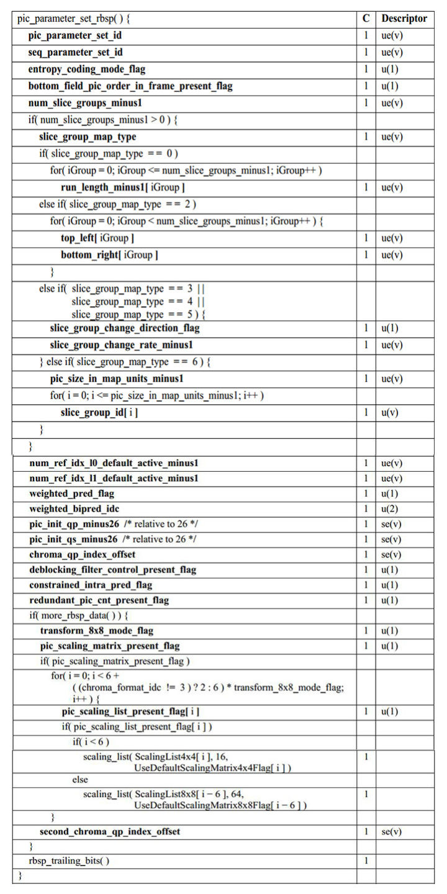

### 码流中的SPS与PPS

**sps与pps都是与具体的编码视频VLC编码单元无关的，在打开编码器后，就可在头部写入SPS与PPS了。**

如下是一个码流，可以看到如果x264配置中打开 `b_repeat_headers `，则会在每个关键帧前加sps、pps


#### 一：x264如何得到sps与pps

```c++
x264_param_t* pParam = (x264_param_t*)malloc(sizeof(x264_param_t));
x264_param_default(pParam);
pParam->b_repeat_headers = false;//在每个关键帧NALU前面加SPS、PPS，false时则没有sps与pps,需要主动x264_encoder_headers获取sps、pps写入文件。
pHandle = x264_encoder_open(pParam);
char start_code[4] = { 0,0,0,1 };
ret = x264_encoder_headers(pHandle, &pNals, &iNal_Count);//获取整个码流使用的sps与pps
//将获取到的sps与pps写入文件
for (auto nax_index = 0; nax_index < iNal_Count; ++nax_index) {
    if (pParam->b_annexb == false)
    {//主动转annexb码流
        output_file.write(start_code, 4);
        output_file.write((char*)pNals[nax_index].p_payload + 4, pNals[nax_index].i_payload - 4);
    }
    else {
        output_file.write((char*)pNals[nax_index].p_payload + 4, pNals[nax_index].i_payload);
    }
}
```


打开




## SPS 参数详解



我们可以从SPS中获取编码的profile，level，图像YUV采样格式，图像的宽高。总览：

```c++
seq_parameter_set_ data() {
// 1. 遵从的h264编码profile（即baseline、Main、Extended或其他罕见级别）
// 2. sps_id（唯一标识这个sps）
// 3. 几个罕见级别对应的句法元素
// 4. 几个用来计算POC的句法元素
// 5. 图像宽高
// 6. 用于解码后图像剪裁的几个句法元素
// 7. vui_parameters( ) (vui的参数)
}
```


详细参数：

```c++
seq_parameter_set_data( ) { 
   /*
   这段视频序列编码时遵从的编码级别，它的值在Annex A中给出。比 
   如baseline、Main、Extended三个profile对应的profile_idc 
   分别为：66、77、88
   */
    profile_idc


/*  —————————— 编码级别的制约条件 Start  —————————— */
   /*
   这个值用来约束h264比特流，是否必须遵从baseline级别的所有制 
   约条件。1表示必须遵从，0表示不必遵从所有条件。关于baseline 
   级别规定的制约条件，在h264文档的A.2.1节
   */
    constraint_set0_flag
   /*
   这个值用来约束h264比特流，是否必须遵从Main级别的所有制约条 
   件。1表示必须遵从，0表示不必遵从所有条件。关于Main级别规定的 
   制约条件，在h264文档的A.2.2节
   */
    constraint_set1_flag
   /*
   这个值用来约束h264比特流，是否必须遵从Extended级别的所有制 
   约条件。1表示必须遵从，0表示不必遵从所有条件。关于Extended级 
   别规定的制约条件，在h264文档的A.2.3节
   */
    constraint_set2_flag
   /* 
   需要注意的是，当constraint_set0_flag、 
   constraint_set1_flag、constraint_set2_flag中的一个或 
   多于一个等于1时，该比特流必须遵从A.2节下面的所有规定。而且当 
   profile_idc等于44、100、110、122或244时， 
   constraint_set0_flag、constraint_set1_flag 和 
   constraint_set2_flag都必须等于0 
   */


    constraint_set3_flag  // 一般用不到，详细可以参考h264文档
    constraint_set4_flag  // 一般用不到，详细可以参考h264文档
    constraint_set5_flag  // 一般用不到，详细可以参考h264文档
/* —————————— 编码级别的制约条件 End  —————————— */


    reserved_zero_2bits // 两个0比特的保留位，解码器会忽略reserved_zero_2bits的值


   /*
   综合profile_idc和level_idc，两个元素一起决定了编解码器的 
   级别。什么意思呢？简单来说，上面的profile_idc指定的是编码所 
   采用的方法，例如采用I、P条带还是I、P、B，是采用CAVLC还是采 
   用CABAC，是否采用加权预测，以及是否采用数据分割。而 
   level_idc，则是对编码的参数进行了限定。比如level_idc值越 
   大，最大宏块处理速率、最大帧长、最大解码图像缓存、最大视频比 
   特率、最大CPB大小，这些编码参数的取值范围也越大。
   */
    level_idc // 

   // 唯一标识这个sps，供pps引用使用
    seq_parameter_set_id 

/*  —————————— 几个罕见级别对应的句法元素 Start  —————————— */
    if( profile_idc = = 100 | | profile_idc = = 110 | | 
        profile_idc = = 122 | | profile_idc = = 244 | | profile_idc = = 44 | |
        profile_idc = = 83 | | profile_idc = = 86 | | profile_idc = = 118 | |
        profile_idc = = 128 | | profile_idc = = 138 | | profile_idc = = 139 | |
        profile_idc = = 134 ) {
       /*
       表示色度取样格式，取值范围0~3，0代表不对色度进行采样，也 
       即只采样亮度。1代表采样格式为：4：2：0，2代表：4：2： 
       2，3代表：4：4：4。当chroma_format_idc不存在时，默认 
       为1。详细见6.2节
       */
        chroma_format_idc
        if( chroma_format_idc = = 3 )
           /*
           当采样格式为4：4：4时，指定颜色分量Y、Cr、Cb的编码模 
           式。如果separate_colour_plane_flag为1，表示对三个分 
           量分别进行编码，也即将一幅彩色图像分成三个单色图像，单独 
           进行编码。如果separate_colour_plane_flag为0则不会分 
           别编码。如果separate_colour_plane_flag不存在，默认 
           为0。
           */
            separate_colour_plane_flag
            
       /*
       指亮度采样点的比特深度和亮度量化参数范围的取值偏移 
       QpBdOffsetY 。计算时, 
       BitDepth(Y) = bit_depth_luma_minus8 + 8
       QpBdOffsetY = bit_depth_luma_minus8 * 6
       当bit_depth_luma_minus8的取值范 
       围为0~4，不存在时，默认为0，即亮度的比特深度取值范围为：8~12
       */
        bit_depth_luma_minus8 
            

       /*
       指色度采样点的比特深度 BitDepth(C)和色度量化参数范围的取值偏移QpBdOffsetC 。
       计算时, 
       BitDepth(C) = bit_depth_chroma_minus8 + 8
       QpBdOffsetC = bit_depth_chroma_minus8 * 6
       当bit_depth_chroma_minus8不存在时，默认为0，它的取值范围为 
       0~4，即亮度的比特深度取值范围为：8~12
       由BitDepth(Y)和BitDepth(C)可以进一步算出，16x16的宏块所需的比特数：
       RawMbBits = 256 * BitDepthY + 2 * MbWidthC * MbHeightC 
       * BitDepthC 
       */
        bit_depth_chroma_minus8 


        qpprime_y_zero_transform_bypass_flag  // 默认为0，暂时用不到，详细可以参考h264文档
        seq_scaling_matrix_present_flag // 等于1表示存在i=0..7或0..11的seq_scaling_list_present_flag[i]


        if( seq_scaling_matrix_present_flag )
            for( i = 0; i < ( ( chroma_format_idc != 3 ) ? 8 : 12 ); i++ ) {
                seq_scaling_list_present_flag[ i ] // 描述子为u(1)，顺序读取存入
                if( seq_scaling_list_present_flag[ i ] ) // 等于1表示sps中存在缩放比例列表I的语法结构
                if( i < 6 )
                    scaling_list( ScalingList4x4[ i ], 16,
                    UseDefaultScalingMatrix4x4Flag[ i ])  // 如果I小于6，则去解析scaling_list()这个语法元素结构，这里注意ScalingList4x4是个二维数组
                else
                    scaling_list( ScalingList8x8[ i − 6 ], 64,
                    UseDefaultScalingMatrix8x8Flag[ i − 6 ] ) // 如果I不小于6，则传入的是二维数组：ScalingList8x8
            }
    }
/*  —————————— 几个罕见级别对应的句法元素 End  —————————— */


/*  —————————— 用来计算POC的句法元素 Start  —————————— */

/*
   1. 这个句法元素是为了读取另一个句法元素frame_num服务的，可 
   以说，frame_num是最重要的句法元素之一，我们在后面还会经常碰到 
   它，因为它标识了所属图像的解码顺序。所以它的第一个作用，就是 
   用来解析frame_num，frame_num是slice_header中的元素，我 
   们后面将会看到。frame_num的解析函数u(v)，里面的变量v就由这 
   个句法元素指定：v = log2_max_frame_num_minus4 + 4
   2. 同时这个句法元素本身，指定了frame_num的最大值： 
   MaxFrameNum = 2^(log2_max_frame_num_minus4+4)
   */
    log2_max_frame_num_minus4 


   /*
   H264定义了3中poc的编码方法，pic_order_cnt_type就是告诉解 
   码器该用哪种方法来计算poc，它的取值范围为：0~2
   由于计算poc，还需要结合slice_header中的句法元素，所以我们 
   在介绍到slice_header时，再详细介绍poc，包括它的算法
   */
    pic_order_cnt_type 
    if( pic_order_cnt_type = = 0 )
       /*
       指明mac_pic_order_cnt_lsb的值，即 
       mac_pic_order_cnt_lsb = 
       2^(log2_max_pic_order_cnt_lsb_minus4+4)
       */
        log2_max_pic_order_cnt_lsb_minus4
    else if( pic_order_cnt_type = = 1 ) {
       /*
       这个句法元素将结合slice_header中的其他句法元素，来决定 
       delta_pic_order_cnt[0]和delta_pic_order_cnt[1] 
       是否应该在slice_header中出现
       */
        delta_pic_order_always_zero_flag
        offset_for_non_ref_pic // 用于计算非参考图像的poc，它的取值范围为[-2^31, 2^31-1]
        offset_for_top_to_bottom_field // 用来计算图像帧中的底场的poc，它的取值范围为[-2^31, 2^31-1]
        num_ref_frames_in_pic_order_cnt_cycle // 用于poc的解码，它的取值范围为[0，255]
        for( i = 0; i < num_ref_frames_in_pic_order_cnt_cycle; i++ )
            offset_for_ref_frame[ i ]  // 当poc为1时，用于解码poc，它指定了参考帧I的偏移量，取值范围为：[-2^31, 2^31-1]
    }


/*  —————————— 用来计算POC的句法元素 End  —————————— */


   /*
   指明参考帧队列可能达到的最大长度
    gaps_in_frame_num_value_allowed_flag // 值为1时，表示 
   允许句法元素frame_num可以不连续，解码器如果检测到frame_num 
   不连续，这时解码器必须启动错误掩藏的机制来恢复这些图像，因为 
   这些图像有可能被后续图像作为参考帧。值为0时，表示不允许 
   frame_num不连续，即编码器任何情况下，都不能丢弃图像。
   */
    max_num_ref_frames


/*  —————————— 图像宽高相关 Start  —————————— */
    pic_width_in_mbs_minus1  // 指定以宏块为单位的图像宽度，即PicWidthInMbs = pic_width_in_mbs_minus1 + 1
   /*
   指定以映射单位为单位的图像高度，即PicHeightInMapUnits = 
   pic_height_in_map_units_minus1 + 1。注意这里得到的并不是图 
   像的高度，而是映射高度，因为我们不知道图像的编码模式是帧、场、还是 
   帧场自适应，所以无法计算。而图像的编码模式，需要结合slice_header 
   中的句法元素，才可以得知。所以我们会在后面介绍slice_header时，再 
   来计算图像高度，并且那时会再详细讨论帧、场和帧场自适应的区别。
   */
    pic_height_in_map_units_minus1
    frame_mbs_only_flag // 是否只含帧宏块，如果为1，说明这个视频序列只含帧宏块，也即所有图像的编码模式都为帧编码，如果为0，则编码模式不确定，需要结合slice_header中的句法元素来确定。
    if( !frame_mbs_only_flag )
        mb_adaptive_frame_field_flag // 指定是否本序列为宏块级的帧场自适应，同样是为了指定本序列图像的编码模式，到slice_header时再详细介绍
/*  —————————— 图像宽高相关 End  —————————— */


   /*
   用于指定B片的B_Skip、B_Direct_16x16 和 B_Direct_8x8模 
   式下，亮度运动矢量的计算过程。当frame_mbs_only_flag为0 
   时，direct_8x8_inference_flag应为1
   */
    direct_8x8_inference_flag


/*  —————————— 解码后图像剪裁的几个句法元素 Start  —————————— */
    frame_cropping_flag // 是否要将图像剪裁后输出，如果为1，则下面if判断中的四个句法元素，分别指定了左、右、上、下剪裁的宽度
    if( frame_cropping_flag ) {
        frame_crop_left_offset
        frame_crop_right_offset 
        frame_crop_top_offset 
        frame_crop_bottom_offset 
    }
/*  —————————— 解码后图像剪裁的几个句法元素 End  —————————— */


   // vui参数
    vui_parameters_present_flag // 是否显示vui_parameters()语法结构
    if( vui_parameters_present_flag )
        vui_parameters( ) // 去解析vui的语法结构，它定义在Annex E中，vui表征了额外的一些视频的可用性信息。
}
```


### PPS




