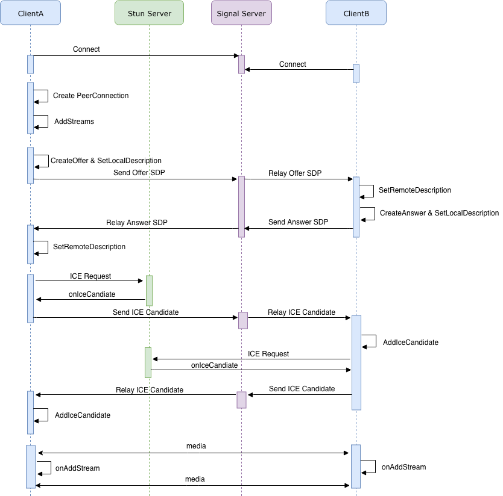
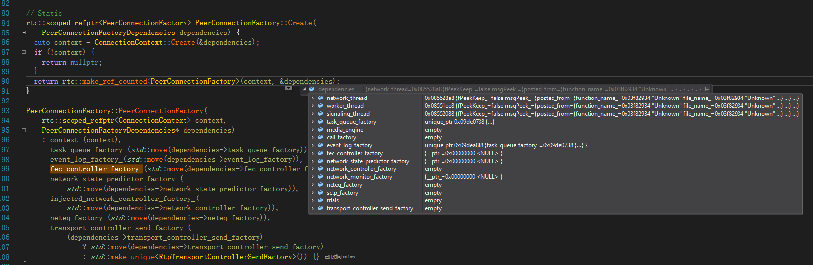
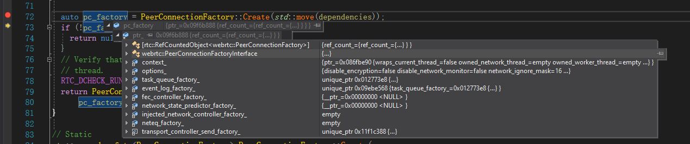

webrtc对外的接口基本都在  **peer_connection_interface.h**该文件中，文件开头介绍了如何使用该组API来进行音视频通信。大致过程如下



相关类型与结构：

* PeerConnectionInterface
* PeerConnectionObserver
* PeerConnectionDependencies
* PeerConnectionFactoryDependencies
* PeerConnectionFactoryInterface
* StatsObserver
* SdpSemantics

所以想搞明白WebRTC的主线，就应该从文章开头的流程图及相关结构开始。


### 一：PeerConnectionFactoryInterface::CreatePeerConnectionFactory

该接口是webrtc sdk的入口，通过peerconnection

**CreatePeerConnectionFactory创建PC工厂时，会创建很多模块的实例，包括：**

* Call工厂 `call_factory`
* 任务队列工厂 `task_queue_factory`
* 事件日志工厂 `event_log_factory`
* 实验性功能配置模块 `trials`
* 发送控制模块 `transport_controller_send_factory_`

其中PeerConnectionFactoryDependencies 其中有很多模块并未创建为nullptr，如

```c++
peer_connection_factory_ = webrtc::CreatePeerConnectionFactory(
      nullptr /* network_thread */, nullptr /* worker_thread */,
      signaling_thread_.get(), nullptr /* default_adm */,
      webrtc::CreateBuiltinAudioEncoderFactory(),
      webrtc::CreateBuiltinAudioDecoderFactory(),
      webrtc::CreateBuiltinVideoEncoderFactory(),
      webrtc::CreateBuiltinVideoDecoderFactory(), nullptr /* audio_mixer */,
      nullptr /* audio_processing */);
```

如下：

```c++
namespace webrtc {

rtc::scoped_refptr<PeerConnectionFactoryInterface> CreatePeerConnectionFactory(
    rtc::Thread* network_thread,
    rtc::Thread* worker_thread,
    rtc::Thread* signaling_thread,
    rtc::scoped_refptr<AudioDeviceModule> default_adm,
    rtc::scoped_refptr<AudioEncoderFactory> audio_encoder_factory,
    rtc::scoped_refptr<AudioDecoderFactory> audio_decoder_factory,
    std::unique_ptr<VideoEncoderFactory> video_encoder_factory,
    std::unique_ptr<VideoDecoderFactory> video_decoder_factory,
    rtc::scoped_refptr<AudioMixer> audio_mixer,
    rtc::scoped_refptr<AudioProcessing> audio_processing,
    AudioFrameProcessor* audio_frame_processor) {
  PeerConnectionFactoryDependencies dependencies;
  dependencies.network_thread = network_thread;
  dependencies.worker_thread = worker_thread;
  dependencies.signaling_thread = signaling_thread;
  dependencies.task_queue_factory = CreateDefaultTaskQueueFactory();
  dependencies.call_factory = CreateCallFactory();
  dependencies.event_log_factory = std::make_unique<RtcEventLogFactory>(
      dependencies.task_queue_factory.get());
  dependencies.trials = std::make_unique<webrtc::FieldTrialBasedConfig>();

  cricket::MediaEngineDependencies media_dependencies;
  media_dependencies.task_queue_factory = dependencies.task_queue_factory.get();
  media_dependencies.adm = std::move(default_adm);
  media_dependencies.audio_encoder_factory = std::move(audio_encoder_factory);
  media_dependencies.audio_decoder_factory = std::move(audio_decoder_factory);
  media_dependencies.audio_frame_processor = audio_frame_processor;
  if (audio_processing) {
    media_dependencies.audio_processing = std::move(audio_processing);
  } else {
    media_dependencies.audio_processing = AudioProcessingBuilder().Create();
  }
  media_dependencies.audio_mixer = std::move(audio_mixer);
  media_dependencies.video_encoder_factory = std::move(video_encoder_factory);
  media_dependencies.video_decoder_factory = std::move(video_decoder_factory);
  media_dependencies.trials = dependencies.trials.get();
  dependencies.media_engine =
      cricket::CreateMediaEngine(std::move(media_dependencies));

  return CreateModularPeerConnectionFactory(std::move(dependencies));
}

}  // namespace webrtc
```

```c++
rtc::scoped_refptr<PeerConnectionFactoryInterface>
CreateModularPeerConnectionFactory(
    PeerConnectionFactoryDependencies dependencies) {
  // The PeerConnectionFactory must be created on the signaling thread.
  if (dependencies.signaling_thread &&
      !dependencies.signaling_thread->IsCurrent()) {
    return dependencies.signaling_thread
        ->Invoke<rtc::scoped_refptr<PeerConnectionFactoryInterface>>(
            RTC_FROM_HERE, [&dependencies] {
              return CreateModularPeerConnectionFactory(
                  std::move(dependencies));
            });
  }
  //创建PeerConnectionFactory
  auto pc_factory = PeerConnectionFactory::Create(std::move(dependencies));
  if (!pc_factory) {
    return nullptr;
  }
  // Verify that the invocation and the initialization ended up agreeing on the
  // thread.
  RTC_DCHECK_RUN_ON(pc_factory->signaling_thread());
  return PeerConnectionFactoryProxy::Create(
      pc_factory->signaling_thread(), pc_factory->worker_thread(), pc_factory);
}
```

PC工厂上下文创建

```c++
// Static
rtc::scoped_refptr<PeerConnectionFactory> PeerConnectionFactory::Create(
    PeerConnectionFactoryDependencies dependencies) {
   //PeerConnectionFactory上下文创建
  auto context = ConnectionContext::Create(&dependencies);
  if (!context) {
    return nullptr;
  }
    //调用 PeerConnectionFactory::PeerConnectionFactory 完成创建
  return rtc::make_ref_counted<PeerConnectionFactory>(context, &dependencies);
}
```



完成构造

```c++
PeerConnectionFactory::PeerConnectionFactory(
    rtc::scoped_refptr<ConnectionContext> context,
    PeerConnectionFactoryDependencies* dependencies)
    : context_(context),
      task_queue_factory_(std::move(dependencies->task_queue_factory)),
      event_log_factory_(std::move(dependencies->event_log_factory)),
      fec_controller_factory_(std::move(dependencies->fec_controller_factory)),
      network_state_predictor_factory_(
          std::move(dependencies->network_state_predictor_factory)),
      injected_network_controller_factory_(
          std::move(dependencies->network_controller_factory)),
      neteq_factory_(std::move(dependencies->neteq_factory)),
      transport_controller_send_factory_(
          (dependencies->transport_controller_send_factory)
              ? std::move(dependencies->transport_controller_send_factory)//创建发送控制工厂
              : std::make_unique<RtpTransportControllerSendFactory>()) {}
```

pc 工厂创建完成以后的成员如下




### 二： PeerConnectionFactoryInterface::CreatePeerConnection


```c++
rtc::scoped_refptr<PeerConnectionInterface>
PeerConnectionFactoryInterface::CreatePeerConnection(
    const PeerConnectionInterface::RTCConfiguration& configuration,
    std::unique_ptr<cricket::PortAllocator> allocator,
    std::unique_ptr<rtc::RTCCertificateGeneratorInterface> cert_generator,
    PeerConnectionObserver* observer) {
  PeerConnectionDependencies dependencies(observer);
  dependencies.allocator = std::move(allocator);
  dependencies.cert_generator = std::move(cert_generator);
    //大部分操作在如下函数中
  auto result =
      CreatePeerConnectionOrError(configuration, std::move(dependencies));
  if (!result.ok()) {
    return nullptr;
  }
  return result.MoveValue();
}
```

```c++
RTCErrorOr<rtc::scoped_refptr<PeerConnectionInterface>>
PeerConnectionFactory::CreatePeerConnectionOrError(
    const PeerConnectionInterface::RTCConfiguration& configuration,
    PeerConnectionDependencies dependencies) {
  RTC_DCHECK_RUN_ON(signaling_thread());
  RTC_DCHECK(!(dependencies.allocator && dependencies.packet_socket_factory))
      << "You can't set both allocator and packet_socket_factory; "
         "the former is going away (see bugs.webrtc.org/7447";

  // Set internal defaults if optional dependencies are not set.
  if (!dependencies.cert_generator) {
    dependencies.cert_generator =
        std::make_unique<rtc::RTCCertificateGenerator>(signaling_thread(),
                                                       network_thread());
  }
  if (!dependencies.allocator) {
    rtc::PacketSocketFactory* packet_socket_factory;
    if (dependencies.packet_socket_factory)
      packet_socket_factory = dependencies.packet_socket_factory.get();
    else
      packet_socket_factory = context_->default_socket_factory();
	//网络端口
    dependencies.allocator = std::make_unique<cricket::BasicPortAllocator>(
        context_->default_network_manager(), packet_socket_factory,
        configuration.turn_customizer);
  }
    
//域名解析工厂
  if (!dependencies.async_resolver_factory) {
    dependencies.async_resolver_factory =
        std::make_unique<webrtc::BasicAsyncResolverFactory>();
  }
    
//ICE 工厂
  if (!dependencies.ice_transport_factory) {
    dependencies.ice_transport_factory =
        std::make_unique<DefaultIceTransportFactory>();
  }

  dependencies.allocator->SetNetworkIgnoreMask(options().network_ignore_mask);
  dependencies.allocator->SetVpnList(configuration.vpn_list);

   //rtc 事件与日志
  std::unique_ptr<RtcEventLog> event_log =
      worker_thread()->Invoke<std::unique_ptr<RtcEventLog>>(
          RTC_FROM_HERE, [this] { return CreateRtcEventLog_w(); });

   //！重点！  Call 模块实例化
  std::unique_ptr<Call> call = worker_thread()->Invoke<std::unique_ptr<Call>>(
      RTC_FROM_HERE,
      [this, &event_log] { return CreateCall_w(event_log.get()); });

    //使用上述参数构造PeerConnection对象
  auto result = PeerConnection::Create(context_, options_, std::move(event_log),
                                       std::move(call), configuration,
                                       std::move(dependencies));
  if (!result.ok()) {
    return result.MoveError();
  }
  // We configure the proxy with a pointer to the network thread for methods
  // that need to be invoked there rather than on the signaling thread.
  // Internally, the proxy object has a member variable named `worker_thread_`
  // which will point to the network thread (and not the factory's
  // worker_thread()).  All such methods have thread checks though, so the code
  // should still be clear (outside of macro expansion).
  rtc::scoped_refptr<PeerConnectionInterface> result_proxy =
      PeerConnectionProxy::Create(signaling_thread(), network_thread(),
                                  result.MoveValue());
  return result_proxy;
}
```


```c++
RTCErrorOr<rtc::scoped_refptr<PeerConnection>> PeerConnection::Create(
    rtc::scoped_refptr<ConnectionContext> context,
    const PeerConnectionFactoryInterface::Options& options,
    std::unique_ptr<RtcEventLog> event_log,
    std::unique_ptr<Call> call,
    const PeerConnectionInterface::RTCConfiguration& configuration,
    PeerConnectionDependencies dependencies) {
  RTCError config_error = cricket::P2PTransportChannel::ValidateIceConfig(
      ParseIceConfig(configuration));
  if (!config_error.ok()) {
    RTC_LOG(LS_ERROR) << "Invalid ICE configuration: "
                      << config_error.message();
    return config_error;
  }

  if (!dependencies.allocator) {
    RTC_LOG(LS_ERROR)
        << "PeerConnection initialized without a PortAllocator? "
           "This shouldn't happen if using PeerConnectionFactory.";
    return RTCError(
        RTCErrorType::INVALID_PARAMETER,
        "Attempt to create a PeerConnection without a PortAllocatorFactory");
  }

  if (!dependencies.observer) {
    // TODO(deadbeef): Why do we do this?
    RTC_LOG(LS_ERROR) << "PeerConnection initialized without a "
                         "PeerConnectionObserver";
    return RTCError(RTCErrorType::INVALID_PARAMETER,
                    "Attempt to create a PeerConnection without an observer");
  }

  bool is_unified_plan =
      configuration.sdp_semantics == SdpSemantics::kUnifiedPlan;
  bool dtls_enabled = DtlsEnabled(configuration, options, dependencies);

  // Interim code: If an AsyncResolverFactory is given, but not an
  // AsyncDnsResolverFactory, wrap it in a WrappingAsyncDnsResolverFactory
  // If neither is given, create a WrappingAsyncDnsResolverFactory wrapping
  // a BasicAsyncResolver.
  // TODO(bugs.webrtc.org/12598): Remove code once all callers pass a
  // AsyncDnsResolverFactory.
  if (dependencies.async_dns_resolver_factory &&
      dependencies.async_resolver_factory) {
    RTC_LOG(LS_ERROR)
        << "Attempt to set both old and new type of DNS resolver factory";
    return RTCError(RTCErrorType::INVALID_PARAMETER,
                    "Both old and new type of DNS resolver given");
  }
  if (dependencies.async_resolver_factory) {
    dependencies.async_dns_resolver_factory =
        std::make_unique<WrappingAsyncDnsResolverFactory>(
            std::move(dependencies.async_resolver_factory));
  } else {
    dependencies.async_dns_resolver_factory =
        std::make_unique<WrappingAsyncDnsResolverFactory>(
            std::make_unique<BasicAsyncResolverFactory>());
  }

  // The PeerConnection constructor consumes some, but not all, dependencies.
    //PeerConnection 的构造
  auto pc = rtc::make_ref_counted<PeerConnection>(
      context, options, is_unified_plan, std::move(event_log), std::move(call),
      dependencies, dtls_enabled);
    //进行初始化
  RTCError init_error = pc->Initialize(configuration, std::move(dependencies));
  if (!init_error.ok()) {
    RTC_LOG(LS_ERROR) << "PeerConnection initialization failed";
    return init_error;
  }
  return pc;
}
```

PeerConnection 构造函数

```c++
PeerConnection::PeerConnection(
    rtc::scoped_refptr<ConnectionContext> context,
    const PeerConnectionFactoryInterface::Options& options,
    bool is_unified_plan,
    std::unique_ptr<RtcEventLog> event_log,
    std::unique_ptr<Call> call,
    PeerConnectionDependencies& dependencies,
    bool dtls_enabled)
    : context_(context),
      options_(options),
      observer_(dependencies.observer),
      is_unified_plan_(is_unified_plan),
      event_log_(std::move(event_log)),
      event_log_ptr_(event_log_.get()),
      async_dns_resolver_factory_(
          std::move(dependencies.async_dns_resolver_factory)),
      port_allocator_(std::move(dependencies.allocator)),
      ice_transport_factory_(std::move(dependencies.ice_transport_factory)),
      tls_cert_verifier_(std::move(dependencies.tls_cert_verifier)),
      call_(std::move(call)),
      call_ptr_(call_.get()),
      // RFC 3264: The numeric value of the session id and version in the
      // o line MUST be representable with a "64 bit signed integer".
      // Due to this constraint session id `session_id_` is max limited to
      // LLONG_MAX.
      session_id_(rtc::ToString(rtc::CreateRandomId64() & LLONG_MAX)),
      dtls_enabled_(dtls_enabled),
      data_channel_controller_(this),
      message_handler_(signaling_thread()),
      weak_factory_(this) {
  worker_thread()->Invoke<void>(RTC_FROM_HERE, [this] {
    RTC_DCHECK_RUN_ON(worker_thread());
    worker_thread_safety_ = PendingTaskSafetyFlag::Create();
    if (!call_)
      worker_thread_safety_->SetNotAlive();
  });
}
```

该函数比较重要，因为其中初始化了PC的重要模块。如网络模块初始化、Stats、SDP Handler、Rtp Manager、

```c++
RTCError PeerConnection::Initialize(
    const PeerConnectionInterface::RTCConfiguration& configuration,
    PeerConnectionDependencies dependencies) {
  RTC_DCHECK_RUN_ON(signaling_thread());
  TRACE_EVENT0("webrtc", "PeerConnection::Initialize");

  cricket::ServerAddresses stun_servers;
  std::vector<cricket::RelayServerConfig> turn_servers;

  RTCErrorType parse_error =
      ParseIceServers(configuration.servers, &stun_servers, &turn_servers);
  if (parse_error != RTCErrorType::NONE) {
    return RTCError(parse_error, "ICE server parse failed");
  }

  // Add the turn logging id to all turn servers
  for (cricket::RelayServerConfig& turn_server : turn_servers) {
    turn_server.turn_logging_id = configuration.turn_logging_id;
  }

  // Note if STUN or TURN servers were supplied.
  if (!stun_servers.empty()) {
    NoteUsageEvent(UsageEvent::STUN_SERVER_ADDED);
  }
  if (!turn_servers.empty()) {
    NoteUsageEvent(UsageEvent::TURN_SERVER_ADDED);
  }

  // Network thread initialization.
  network_thread()->Invoke<void>(RTC_FROM_HERE, [this, &stun_servers,
                                                 &turn_servers, &configuration,
                                                 &dependencies] {
    RTC_DCHECK_RUN_ON(network_thread());
    network_thread_safety_ = PendingTaskSafetyFlag::Create();
    InitializePortAllocatorResult pa_result =
        InitializePortAllocator_n(stun_servers, turn_servers, configuration);
    // Send information about IPv4/IPv6 status.
    PeerConnectionAddressFamilyCounter address_family =
        pa_result.enable_ipv6 ? kPeerConnection_IPv6 : kPeerConnection_IPv4;
    RTC_HISTOGRAM_ENUMERATION("WebRTC.PeerConnection.IPMetrics", address_family,
                              kPeerConnectionAddressFamilyCounter_Max);
    InitializeTransportController_n(configuration, dependencies);
  });

  configuration_ = configuration;

  stats_ = std::make_unique<StatsCollector>(this);
  stats_collector_ = RTCStatsCollector::Create(this);

  sdp_handler_ =
      SdpOfferAnswerHandler::Create(this, configuration, dependencies);

  rtp_manager_ = std::make_unique<RtpTransmissionManager>(
      IsUnifiedPlan(), signaling_thread(), worker_thread(), channel_manager(),
      &usage_pattern_, observer_, stats_.get(), [this]() {
        RTC_DCHECK_RUN_ON(signaling_thread());
        sdp_handler_->UpdateNegotiationNeeded();
      });

  // Add default audio/video transceivers for Plan B SDP.
  if (!IsUnifiedPlan()) {
    rtp_manager()->transceivers()->Add(
        RtpTransceiverProxyWithInternal<RtpTransceiver>::Create(
            signaling_thread(),
            new RtpTransceiver(cricket::MEDIA_TYPE_AUDIO, channel_manager())));
    rtp_manager()->transceivers()->Add(
        RtpTransceiverProxyWithInternal<RtpTransceiver>::Create(
            signaling_thread(),
            new RtpTransceiver(cricket::MEDIA_TYPE_VIDEO, channel_manager())));
  }

  int delay_ms = configuration.report_usage_pattern_delay_ms
                     ? *configuration.report_usage_pattern_delay_ms
                     : REPORT_USAGE_PATTERN_DELAY_MS;
  message_handler_.RequestUsagePatternReport(
      [this]() {
        RTC_DCHECK_RUN_ON(signaling_thread());
        ReportUsagePattern();
      },
      delay_ms);

  return RTCError::OK();
}
```

