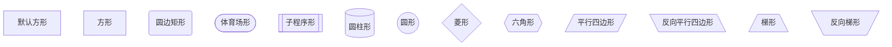

饼状图

RTC主要KPI

* RTC SDK API行为对齐声网，满足云教室业务端需求

* 解决通信过程中看不见、听不见

* 黑屏、绿屏问题、声音异常

* 设备兼容性问题处理

  

  

  * room模块健壮性
    * 未正常退出，进入不了教室
    * 异步通信，lambda回调崩溃问题
  * 设备兼容性问题
    * 音频初始化失败
    * 采集过程中异常
    * 视频采集数据大小异常
    * win7 loopback兼容

* 解决声音异常问题

  * 屏幕共享回音及音频

* 解决黑屏、绿屏问题

  

