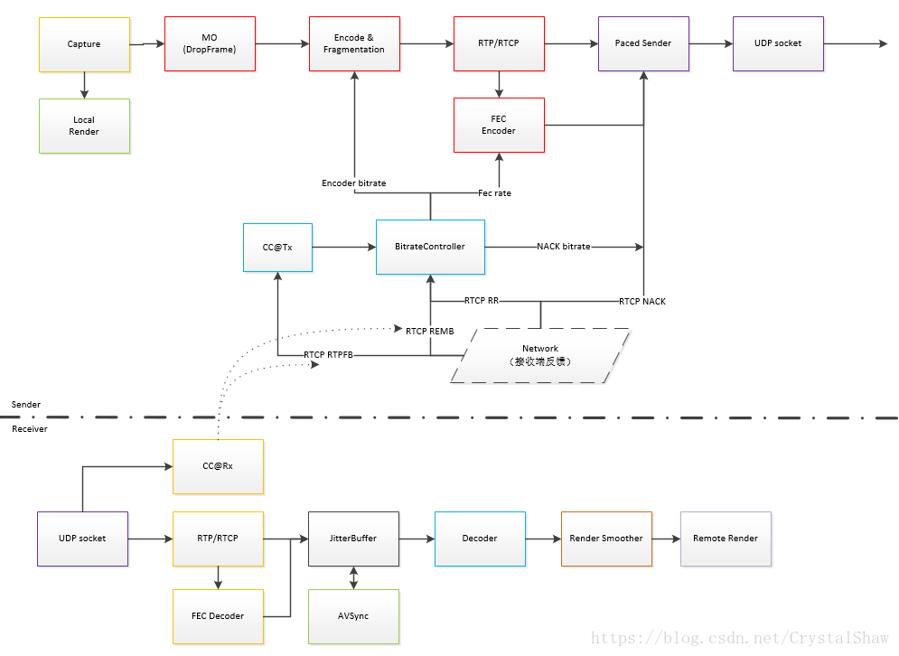
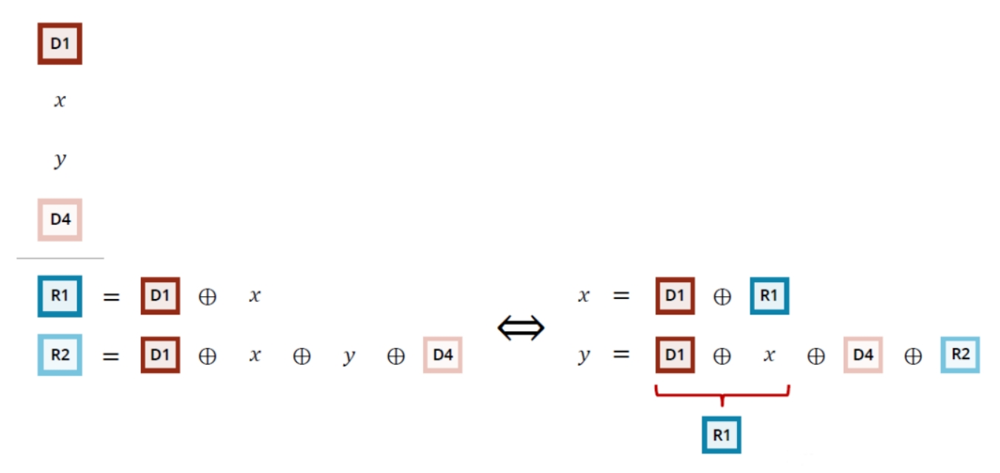
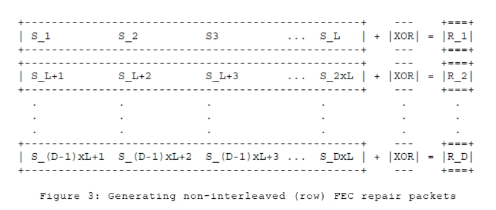
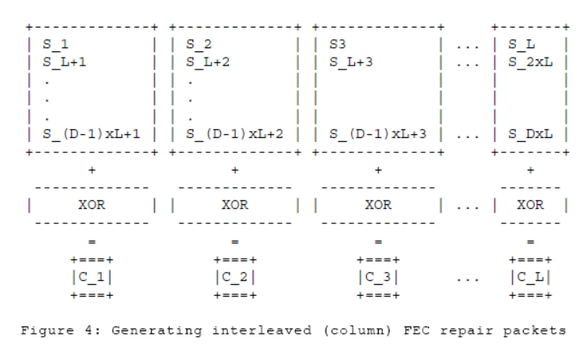
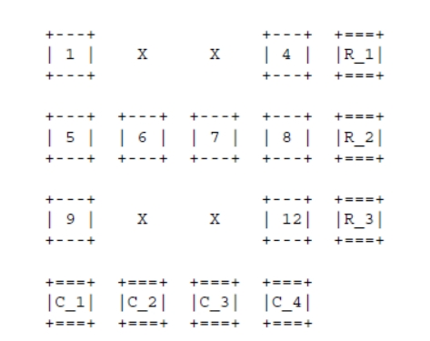
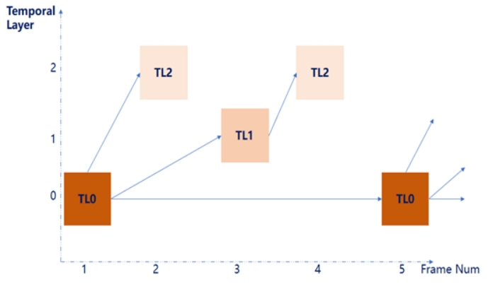
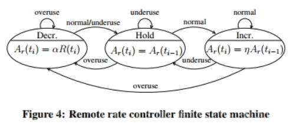

Webrtc中的QOS策略有：

> 目前总结出WebRTC用于提升QoS的方法有：NACK、FEC、SVC、JitterBuffer、IDR Request、Pacer、Sender Side BWE、Probe、VFR（动态帧率调整策略）、AVSync（音视频同步）、动态分辨率调整。这几种方法在WebRTC架构分布如下：

参考：https://mp.weixin.qq.com/s/NQco5wg-j5t1-fW63G06Uw

##  **1. NACK**

与NACK对应的是ACK，ACK是到达通知技术。以TCP为例，他可靠因为接收方在收到数据后会给发送方返回一个“已收到数据”的消息（ACK），告诉发送方“我已经收到了”，确保消息的可靠。

 

 

NACK也是一种通知技术，只是触发通知的条件刚好的ACK相反，在未收到消息时，通知发送方“我未收到消息”，即通知未达。

 

 

NACK是在接收端检测到数据丢包后，发送NACK报文到发送端；发送端根据NACK报文中的序列号，在发送缓冲区找到对应的数据包，重新发送到接收端。NACK需要发送端发送缓冲区的支持，RFC5104定义NACK数据包的格式。若在JB缓冲时间内接收端收到发送端重传的报文，就可以解决丢包问题。对应上图发送端的RTCP RTPFB。

 

## **2. FEC**

FEC是发送端在发送报文的时候，将之前的旧包也打包到新包里面，若接收端有丢包，就用新包里面冗余的旧包恢复数据。

 

webrtc实现该冗余功能，有三种方式：- **RED就是RFC2198冗余**。将前面的报文直接打入到新包里面，在接收端解析主包和冗余包。目前WebRTC的ULPFEC仅借用RFC2198冗余报文的封装格式，冗余报文的载荷用的是ULPFEC编码出来的载荷。- **ULPFEC**，目前webrtc仅将VPX编码器SVC时域的Level 0视频帧打包成FEC。其余层有丢包，就逐步将帧率，保证视频相对流畅。

· 发送端打包示意图:

 

 

· 网络丢包示意图:

 

 

· 丢包恢复示意图:

 

 

\- **FLEXFEC**较ULPFEC，增加纵向OXR运算。增加网络抗丢包能力。

· 1D行异或:

 

 

· 1D列异或:

 

 

· 2D行列异或:

 

 

## **3. SVC**

SVC（可适性视频编码或可分级视频编码）是传统H.264/MPEG-4 AVC编码的延伸，可提升更大的编码弹性，并具有时间可适性（Temporal Scalability）、空间可适性（Spatial Scalability）及质量可适性（SNR/Quality/Fidelity scalability）三大特性，使视频传输更能适应在异质的网络带宽。

 

实际上Spatial Scalability和quality scalability这种方案会增加传输码率，降低编解码器性能、提高编解码器的复杂度、在一些场景下还需要服务器支持SVC层级过滤。使得SVC的Spatial Scalability和quality scalability到目前为止还没有大规模应用。但是Temporal Scalability可以在不稳定网络视频传输上被使用。

 

WebRTC的vpx编码器使用了Temporal Scalability时间可适性编码，仅需通过FEC+NACK方式保护T0层的数据完整性，其余层的视频帧有丢失，可通过逐级降帧率方案（丢弃Tn-T1之间的数据），保证视频通话整体的流畅性。并且Temporal Scalability可以做到后向兼容，不需要解码器做特殊处理。

 

 

## **4. JitterBuffer**

JitterBuffer实现原理是，在收到网络上的RTP报文后，不直接进行解码，需要缓存一定个数的RTP报文，按照时间戳或者seq的顺序进行重排，消除报文的乱序和抖动问题。JitterBuffer分动态JitterBuffer和静态JitterBuffer两种模式。静态JitterBuffer缓存报文个数固定。动态JitterBuffer是根据网络环路延时的情况，动态调整缓存报文个数。

 

## **5. IDR Request**

关键帧也叫做即时刷新帧，简称IDR帧。对视频来说，IDR帧的解码无需参考之前的帧，因此在丢包严重时可以通过发送关键帧请求进行画面的恢复。关键帧的请求方式分为三种：RTCP FIR反馈（Full intra frame request）、RTCP PLI 反馈（Picture Loss Indictor）或SIP Info消息，具体使用哪种可通过协商确定。

## **6. Pacer**

PACER，是网络报文平滑策略。一个视频帧有可能分别封装在几个RTP报文，若这个视频帧的RTP报文一起发送到网络上，必然会导致网络瞬间拥塞。以25fps为例，若这帧视频的RTP报文，能够在40ms之内发送给接收端，接收端既可以正常工作，也缓冲了网络拥塞的压力。PACER就是实现把RTP同一时刻生产的若干包，周期性的发送，防止上行流量激增导致拥塞。

 

 

## **7. Sender Side BWE或REMB（Receiver Estimated Maximum Bitrate）**

这个算法的思路是根据接收端的丢包率或延时情况维护一个状态机。以根据丢包率为例，在判断为overuse时，就根据一定的系数减少当前发送端的码率值，当判断为underuse时又根据增加系数来增加发送端的码率值；然后将这个值通过rtcp包发送给发送端，发送端根据该值来动态的调整码率。

 

 

 

 

## **8. Probe**

WebRTC在决定以多大码率发送报文时，会遇到如下难处：

* 发送端通过GCC算法，根据网络状态动态调节发送的码率。但是系统启动阶段初始码率应该设置成多大比较合适？

* GCC估计带宽，这个算法的特点是：快降慢升，网络质量差时能迅速响应衰减带宽；但是网络持续向好时，不能迅速增加对应带宽。

所以需要一种快速探测算法，探测当前网络合适的带宽，保证音视频按照最佳码率值发送数据。

## **9. 动态帧率调整策略**

视频发送端根据Sender Side BWE或REMB等参数调整出一组比较合适的码率值，当网络条件好的时候，码率值会比较大，当网络条件比较差的时候，码率值会比较低。但是若是发送端仅调整码率，不调整帧率，当网络条件比较好的时候，仅仅提升了视频质量，没有充分利用网络条件，提升实时性。当网络条件比较差的时候，码率降的比较低，若不降低帧率，视频质量会大幅度下降。所以需要增加一种机制，根据发送端的码率值，动态调整发送端的帧率值。

 

## **10. AVSync音视频同步**

由于音视频处理的系统路径不同，并且音视频媒体流是分开以RTP over UDP报文形式传输，UDP报文对网络丢包延时敏感，若不进行特殊平滑处理，会导致实际播放时音视频的渲染相对延时与采集延时有偏差，这样就容易产生音视频不同步现象。音视频同步的基本思想是，以RTCP报文的NTP时间为参考，在接收端渲染前，对音视频分别进行不同长度的适当缓冲，尽量保证音视频渲染different time = 音视频采集different time。保证音视频同步。

 

## **11. 动态分辨率调整策略**

动态分辨率调整策略设计思想是，在网络传输质量变差、CPU占有率过高，编码器编码质量QP值过大等情况下，动态降低视频传输分辨率，缓解当前异常。反之则动态增加分辨率，提供高质量的视频传输。目前webrtc这块还处于调测阶段。

 

## **12. HARQ**

WebRTC还会根据当前网络状态的质量，动态调整QOS策略，在低延时低丢包网络下，仅使用NACK的QOS手段，在高延时高丢包场景下，动态选择NACK、FEC、SVC三种QOS策略。

 

 