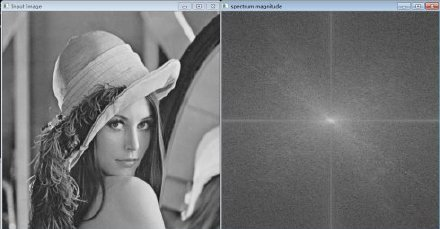
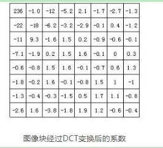

## 图像的频域

理解图像的高频与低频：主要成分是低频信息，它形成了图像的基本灰度等级，对图像结构的决定作用较小；中频信息决定了图像的基本结构，形成了图像的主要边缘结构；高频信息形成了图像的边缘和细节，是在中频信息上对图像内容的进一步强化。形象一点说：亮度或灰度变化激烈的地方对应高频成分，如边缘；变化不大的地方对于低频成分，如大片色块区。画个直方图，大块区域是低频，小块或离散的是高频。

把图像看成二维函数，变化剧烈的地方就对应高频，反之低频。
举个通俗易懂的例子：一幅图象，你戴上眼镜，盯紧了一个地方看到的是高频分量。摘掉眼镜，眯起眼睛，模模糊糊看到的就是低频分量。

图像的高低频是对图像各个位置之间强度变化的一种度量方法.
低频分量:主要对整副图像的强度的综合度量.
高频分量:主要是对图像边缘和轮廓的度量.

如果一副图像的各个位置的强度大小相等,则图像只存在低频分量,从图像的频谱图上看,只有一个主峰,且位于频率为零的位置.

如果一副图像的各个位置的强度变化剧烈,则图像不仅存在低频分量,同时也存在多种高频分量,从图像的频谱上看,不仅有一个主峰,同时也存在多个旁峰。

原图与频谱图：

傅里叶变换：https://www.jezzamon.com/fourier/zh-cn.html

理解声音的高频与低频：忽略掉较小幅度的高频成分来压缩声音，尽管得出的波形与原始波形不一样，但是听起来将会和原始声音很接近。

## 压缩原理

需要消除哪些冗余：

* 数据冗余。例如如空间冗余、时间冗余、结构冗余、信息熵冗余等。即图像的各像素之间存在着很强的相关性。消除这些冗余并不会导致信息损失，属于无损压缩。
* 视觉冗余。人眼的一些特性比如亮度辨别阈值，视觉阈值，对亮度和色度的敏感度不同，使得在编码的时候引入适量的误差，也不会被察觉出来。可以利用人眼的视觉特性，以一定的客观失真换取数据压缩。这种压缩属于有损压缩。

一般的数字视频压缩编码方法都是混合编码，即将变换编码，运动估计和运动补偿，以及熵编码三种方式相结合来进行压缩编码。

**1. 变换编码**

通常使用变换编码来消去除图像的帧内冗余。变换编码的作用是将空间域描述的图像信号变换到频率域，然后对变换后的系数进行编码处理。一般来说，图像在空间上具有较强的相关性，变换到频率域可以实现去相关和能量集中。常用的正交变换有离散傅里叶变换，离散余弦变换等等。数字视频压缩过程中应用广泛的是离散余弦变换。

离散余弦变换简称为DCT变换。它可以将L\*L的图像块从空间域变换为频率域。所以，在基于DCT的图像压缩编码过程中，首先需要将图像分成互不重叠的图像块。假设一帧图像的大小为1280\*720，首先将其以网格状的形式分成160\*90个尺寸为8\*8的彼此没有重叠的图像块，接下来才能对每个图像块进行DCT变换。

经过分块以后，每个8\*8点的图像块被送入DCT编码器，将8\*8的图像块从空间域变换为频率域。下图给出一个实际8*8的图像块例子，图中的数字代表了每个像素的亮度值。从图上可以看出，在这个图像块中各个像素亮度值比较均匀，特别是相邻像素亮度值变化不是很大，说明图像信号具有很强的相关性。

下图是上图中图像块经过DCT变换后的结果。从图中可以看出经过DCT变换后，左上角的低频系数集中了大量能量，而右下角的高频系数上的能量很小。

信号经过DCT变换后需要进行量化。由于人的眼睛对图像的低频特性比如物体的总体亮度之类的信息很敏感，而对图像中的高频细节信息不敏感，因此在传送过程中可以少传或不传送高频信息，只传送低频部分。量化过程通过对低频区的系数进行细量化，高频区的系数进行粗量化，去除了人眼不敏感的高频信息，从而降低信息传送量。因此，量化是一个有损压缩的过程，而且是视频压缩编码中质量损伤的主要原因。

量化的过程可以用下面的公式表示：

其中FQ（u,v）表示经过量化后的DCT系数；F（u,v）表示量化前的DCT系数；Q（u,v）表示量化加权矩阵；q表示量化步长；round表示归整，即将输出的值取为与之最接近的整数值。

合理选择量化系数，对变换后的图像块进行量化后的结果如图所示。

DCT系数经过量化之后大部分经变为0，而只有很少一部分系数为非零值，此时只需将这些非0值进行压缩编码即可。

如图是对一个宏块进行不同程度量化的结果：

**2. 熵编码**

熵编码是因编码后的平均码长接近信源熵值而得名。熵编码多用可变字长编码（VLC，Variable Length Coding）实现。其基本原理是对信源中出现概率大的符号赋予短码，对于出现概率小的符号赋予长码，从而在统计上获得较短的平均码长。可变字长编码通常有霍夫曼编码、算术编码、游程编码等。其中游程编码是一种十分简单的压缩方法，它的压缩效率不高，但编码、解码速度快，仍被得到广泛的应用，特别在变换编码之后使用游程编码，有很好的效果。

首先要在量化器输出直流系数后对紧跟其后的交流系数进行Z型扫描（如图箭头线所示）。Z型扫描将二维的量化系数转换为一维的序列，并在此基础上进行游程编码。最后再对游程编码后的数据进行另一种变长编码，例如霍夫曼编码。通过这种变长编码，进一步提高编码的效率。

**3.运动估计和运动补偿**

运动估计（Motion Estimation）和运动补偿（Motion Compensation）是消除图像序列时间方向相关性的有效手段。上文介绍的DCT变换、量化、熵编码的方法是在一帧图像的基础上进行，通过这些方法可以消除图像内部各像素间在空间上的相关性。实际上图像信号除了空间上的相关性之外，还有时间上的相关性。例如对于像新闻联播这种背景静止，画面主体运动较小的数字视频，每一幅画面之间的区别很小，画面之间的相关性很大。对于这种情况我们没有必要对每一帧图像单独进行编码，而是可以只对相邻视频帧中变化的部分进行编码，从而进一步减小数据量，这方面的工作是由运动估计和运动补偿来实现的。

运动估计技术一般将当前的输入图像分割成若干彼此不相重叠的小图像子块，例如一帧图像的大小为1280\*720，首先将其以网格状的形式分成40\*45个尺寸为16\*16的彼此没有重叠的图像块，然后**在前一图像或者后一个图像某个搜索窗口的范围内为每一个图像块寻找一个与之最为相似的图像块。这个搜寻的过程叫做运动估计。** **通过计算最相似的图像块与该图像块之间的位置信息，可以得到一个运动矢量。这样在编码过程中就可以将当前图像中的块与参考图像运动矢量所指向的最相似的图像块相减，得到一个残差图像块，由于残差图像块中的每个像素值很小，所以在压缩编码中可以获得更高的压缩比。这个相减过程叫运动补偿。**

由于编码过程中需要使用参考图像来进行运动估计和运动补偿，因此参考图像的选择显得很重要。一般情况下编码器的将输入的每一帧图像根据其参考图像的不同分成3种不同的类型：I（Intra）帧、B（Bidirection prediction）帧、P（Prediction）帧。

如图所示，I帧只使用本帧内的数据进行编码，在编码过程中它不需要进行运动估计和运动补偿。显然，由于I帧没有消除时间方向的相关性，所以压缩比相对不高。P帧在编码过程中使用一个前面的I帧或P帧作为参考图像进行运动补偿，实际上是对当前图像与参考图像的差值进行编码。B帧的编码方式与P帧相似，惟一不同的地方是在编码过程中它要使用一个前面的I帧或P帧和一个后面的I帧或P帧进行预测。由此可见，每一个P帧的编码需要利用一帧图像作为参考图像，而B帧则需要两帧图像作为参考。相比之下，B帧比P帧拥有更高的压缩比。

如图所示，I帧只使用本帧内的数据进行编码，在编码过程中它不需要进行运动估计和运动补偿。显然，由于I帧没有消除时间方向的相关性，所以压缩比相对不高。P帧在编码过程中使用一个前面的I帧或P帧作为参考图像进行运动补偿，实际上是对当前图像与参考图像的差值进行编码。B帧的编码方式与P帧相似，惟一不同的地方是在编码过程中它要使用一个前面的I帧或P帧和一个后面的I帧或P帧进行预测。由此可见，每一个P帧的编码需要利用一帧图像作为参考图像，而B帧则需要两帧图像作为参考。相比之下，B帧比P帧拥有更高的压缩比。

