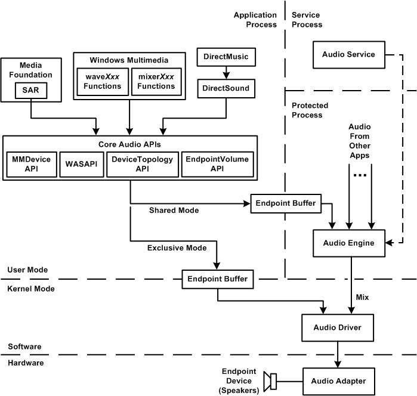
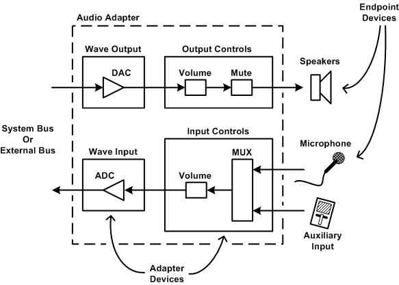
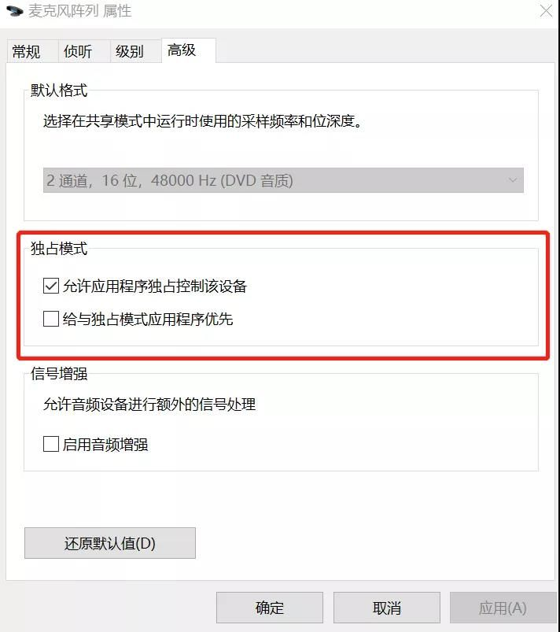

参考：https://zhuanlan.zhihu.com/p/381842003

历史发展参考：http://shanekirk.com/2015/10/a-brief-history-of-windows-audio-apis/

Windows存在很多相关的音频API，哪一个才是最好的？ 需要选择哪个？下面从发展史进行介绍。

windows 音频SDK发展史：MME -> DIRECTSOUND -> WDM ->WASAPI 

Windows 音频系统架构

* **1991年~1992年---Windows Multimedia Extensions (MME/WinMM)**

  >MME是第一个适用于Windows的标准音频API。
  >
  >历史环境：1991年大多数PC拥有很小的扬声器，只能发生哔哔声和嗡嗡声。可以使用脉冲宽度调制技术来产生更复杂的声音，但质量比较差。然后产生了很多厂商生产专业的音频设备作为外设来进行声音播放。正式因此Windows决定在Windows3.0（已发布1年）中支持音频API： Windows 3.0 with Multimedia Extensions。MME 既有高级 API 又有低级 API。低级 API 支持波形音频和 MIDI 输入/输出。它的函数名称以 waveIn、waveOut、midiIn、midiStream 等开头。高级 API 媒体控制接口 (MCI) 非常高级。MCI 类似于设备的脚本语言。当 Windows 3.1 于 1992 年问世时，MME 正式诞生。
  >
  >优势：MME方法实现简单。
  >
  >**劣势**：延时是一个重大的问题，动态，实时的音频（比如实时音频通话，游戏事件通知等）有点难以及时处理，一般最小时延能达到120ms。在实时音频场景中，任何比大脑认为应该发生的时间晚10毫秒的事情都被认为是不同步的。当年只能处理最大 96kHz 和 16 位音频，但是在现代版本的 Windows 中，MME 构建在 Core Audio 之上（稍后会详细介绍）。您可能会发现，即使设备无法将自己报告为能够提供更高质量的音频，但更高的采样率和位深度仍然可以工作。

* **1995年-DirectSound（又名DirectX Audio）**

  >DirectX 是基于COM的多媒体API集合的总称，其中包括 DirectSound。
  >
  >历史：Windows 95发布，除了为我们提供了臭名昭著的“开始”按钮和 Weezer 的“Buddy Holly”的音乐视频外，Windows 95 还带来了 DirectX。DirectX 是微软赢得游戏开发者战略的核心，他们认为游戏开发者对于 Windows 95 的成功至关重要。DirectX 是基于 COM 的多媒体 API 集合的总称，其中包括 DirectSound。DirectSound 通过提供动态采样率转换、效果、多流混合、备用缓冲策略和硬件加速*（在现代版本的 Windows 中不再是这种情况。请参阅关于下面的核心音频）*。因为 DirectSound 是使用内核模式驱动程序 VxD 实现的，所以它可以在非常接近硬件的情况下工作。与 MME 相比，它提供了更低的延迟并支持更高质量的音频。DirectSound 使通过简单的 API 与硬件交互变得切实可行。**这允许专业音频应用程序将自己与它们支持的硬件分离。专业级音频软件和硬件之间的脐带可能被切断。**低延迟、多流混合、高分辨率音频、可插入、效果和乐器——所有这些都是 DirectSound 的巨大胜利。
  >
  >优势：
  >
  >1）它可以非常接近硬件工作，极限最小延迟可到60毫秒左右，并支持更高质量的音频；
  >
  >2）可通过简单的API使得与硬件交互变得切实可行；
  >
  >3）为平台带来了可插拔的、基于软件的音频效果（DX 效果）和乐器（DXi Instruments）。

* **1998年---Windows Driver Model/Kernel Streaming (WDM/KS)**

  >历史：在 Windows 95 尘埃落定之后，微软开始研究他们的驱动程序模型，此时Windows NT 已经存在了几年。尽管提供与 16 位/32 位混合同级产品相同的 Win32 API 支持，但是Windows NT 有一个非常不同的驱动程序模型。这意味着如果硬件供应商想要同时支持 Windows NT 和 Windows 95，他们需要编写两个完全独立的驱动程序——使用 Windows NT 驱动程序模型构建的 NT 驱动程序和其他的 VxD程序。
  >
  >微软决定解决这个问题，Windows 驱动模型 (WDM) 诞生了。WDM 实际上是 Windows NT 驱动模型的增强版本，它比 Windows 95 和 3.x 使用的 VxD 更复杂一些。然而，WDM 的一大目标是在所有未来版本的 Windows 中兼容二进制和源代码。一套API来进行处理。
  >
  >除了 VxD 之外，Windows 98 是第一个支持 WDM 的 Windows 官方版本。此后的所有 Windows 版本实际上都是 Windows NT 技术的迭代。WDM 从此成为 Windows 的唯一驱动程序模型。
  >
  >那么这个 WDM 业务与音频 API 有什么关系呢？在 WDM 出现之前，Windows 开发人员使用的是 DirectSound 或 MME。使用 WDM 后，MME 和 DirectSound 音频现在都通过称为内核音频混合器（通常称为 KMixer）的东西。KMixer 是一个内核模式组件，负责将所有系统音频混合在一起。但是 KMixer 也会引入了延迟，大概30毫秒，事实上，有时会更多。为了减少 KMixer 带来的时延，WDM/KS 的方案诞生了。WDM/KS 技术涉及直接与硬件的流驱动程序对话，完全绕过 KMixer，减少延迟。KS 代表内核流。内核流本身不是官方的音频 API。这是 WDM 音频驱动程序作为其基础架构的一部分支持的东西。WDM/KS 技术涉及直接与硬件的流驱动程序对话，完全绕过 KMixer。通过这样做，应用程序可以避免支付 KMixer 性能税，减少 CPU 的负载，并直接控制传送到音频硬件的数据。
  >
  >劣势：
  >
  >1）独占了声卡的所有资源，导致只能听到特定应用程序的声音。当多个程序开启时，是无法听到其他应用程序的声音的；
  >
  >2）KS 也没有音频输入，即麦克风也是无法使用的。
  >
  >注意：在 Vista 和 Windows7之后，KMixer 已经被弃用了，KS并不适用于 Vista 和 Windows7之后的版本。

*  **2007年---Windows Core Audio**

  >2007年，Vista 最终上架时，Windows Core Audio 也面世了。微软宣称，vista/7 已经开始弃用了 kmixer 和依赖 DMA 的 audio IO。熟悉和喜爱的所有音频API都被洗牌，突然发现自己建立在这个新的用户模式API之上，这包括 DirectSound，此时它完全失去了对硬件加速音频的支持。此时，您可能会认为 WDM/KS 可以消失。好吧，它不能。正如我之前所说，它并不是真正的 API。它是 WDM 驱动程序基础设施的一部分,因此只要 WDM 存在，它就会继续存在。在撰写本文时，Windows 10 是最新版本的 Windows，Core Audio 仍然是平台音频的基础。
  >
  >优势：
  >
  >1）低延迟、故障恢复的音频流；
  >
  >2）提高可靠性（许多音频功能已从内核模式转移到用户模式）；
  >
  >3）提高安全性（受保护的音频内容的处理在安全、低权限的过程中进行）；
  >
  >4）将特定的系统范围角色（控制台、多媒体和通信）分配给各个音频设备；
  >
  >5）用户直接操作的音频端点设备（例如，扬声器、耳机和麦克风）的软件抽象。
  >
  >Windows 采集播放中有着多种API，但是大多数API都是位于 Core Audio之上，在实时音频领域应该推崇使用更接近底层的 API（ASIO或者Core Audio），可减少一定的时延。由于 ASIO 存在一定的局限性，Core Audio 更具有适用性。因此在现有大多数的 Windows 音视频通信客户端中采集播放使用的都是 Core Audio APIs。

* **其他：Audio Stream Input Output（ASIO）第三方音频 API 不是由 Microsoft 发明的**

  >ASIO 最初是 Windows 的专业音频级驱动程序规范，由一家名叫 Steinberg 的德国公司所提出的。(非Windows 标准API)
  >
  >优势：为应用程序提供直接从应用程序到声音硬件的高质量、低延迟的数据路径。对于可以支持 ASIO 的应用程序，可以完全避免所有处理Windows 音频堆栈的业务，将系统对音频流的响应时间降至最短。使用 ASIO 的情况下，缓冲器依照设定的不同可至10毫秒以下，也有因环境较佳而到1毫秒以下的情况产生。
  >
  >劣势：如果您尝试使用的音频应用程序仅支持 ASIO，而您的声卡是廉价的、缺乏 ASIO 支持的，那么使用 ASIO 就是一个问题了。ASIO 的实际性能取决于制造商提供的驱动程序的质量。

### Windows Core Audio APIS系统内核架构

Core Audio音频系统框架图，上图仅显示终结点设备的音频呈现数据路径，关系图不显示音频捕获数据路径。

从系统框架图可以看到Core Audio APIs包含了4个API——MMDevice、WASAPI、DeviceTopology 和 EndpointVolume。

* **MMDevice API**

客户端发现音频终端设备，枚举出所有可使用的音频设备属性以及确定其功能，并为这些设备创建驱动程序实例。是最基本的 Core Audio API，服务于其他3个 APIs。

* **WASAPI**

管理应用程序和音频终端设备之间音频数据的流。**WASAPI 是主力 API。这是所有动作发生的地方。**

* **DeviceTopology API**

可与音频路径中存在的所有软件组件交互

* **EndpointVolume API**

客户端可以控制和监视音频终端设备的音量级别。

## 音频终端设备

音频终端设备包括扬声器、耳机、麦克风和 CD 播放器。

在下图中，终结点设备的示例：

- 扬声器
- 麦克风
- 辅助输入设备

适配器设备的示例：

- 波形输出设备 (包含数字到模拟转换器)
- 输出控件设备 (包含音量和静音控件)
- 波形输入设备 (包含模拟到数字转换器)
- 输入控件设备 (包含音量控制和多路复用器)

Core Audio 为我们带来的另一项重大改进是能够在共享模式（Shared Mode）或独占模式（Exclusive Mode）下运行。

共享模式与旧的 KMixer 模型有一些相似之处。在共享模式下，应用程序写入一个缓冲区，该缓冲区被移交给系统的音频引擎。音频引擎负责将所有应用程序的音频混合在一起并将混合后发送到音频驱动程序。与 KMixer 一样，这会引入延迟。

独占模式是微软对专业音频世界的回应。独占模式与 WDM/KS 具有许多相同的优点。应用程序可以独占访问硬件，音频数据直接从应用程序传输到驱动程序再到硬件。与共享模式相比，独占模式的音频格式还具有更大的灵活性。音频数据格式可以是硬件支持的任何格式——甚至是非 PCM 数据。

---

**共享模式**

共享模式与旧的 KMixer 模式有一些相似之处。在共享模式下，应用程序写入传递给系统音频引擎的缓冲区。音频引擎负责将所有应用程序的音频混合在一起并将混合发送到音频驱动程序。与 KMixer 一样，这会引入延迟。音频引擎有时不仅需要转换音频数据，而且还必须混合来自多个共享模式应用程序的数据。这需要时间，通常是几毫秒。在大多数情况下，这种延迟是无法察觉的。

**独占模式**

独享是微软对专业音频世界的回应。独占模式的应用程序具有对硬件的独占访问权限，音频数据直接从应用程序传输到驱动程序再到硬件。独占模式的流媒体完全绕过了 Windows 音频引擎。它有效地锁定了所有的应用程序，相比于共享模式，独占模式音频的一个明显优势是，随着音频引擎的退出，它所带来的延迟被完全消除了。

但是独占模式流媒体的最大缺点是，对音频格式没有多少灵活性。只能使用音频适配器原生支持的格式。如果需要进行数据格式转换，应用程序将需要手动完成。值得指出的是，独占模式的流媒体实际上并不保证对应用程序可用。它是用户可配置的。用户可以为一个给定的音频适配器完全禁用独占模式音频。如下图：

系统框架图中音频流最终流向了音频适配器。音频适配器很少有单一的输入和/或输出连接。事实上，大多数现代消费类个人电脑的音频适配器都支持至少三种类型的连接：耳机、扬声器和话筒。

在这一章，已经看到了音频流这个短语，音频流指的是应用程序和音频终端设备之间的一个连接。

Windows音频服务是实现Windows音频策略的模块。 音频策略是一组内部规则，系统适用于多个共享和竞争使用同一音频硬件的应用程序之间的音频流之间的交互。 Windows音频服务通过设置音频引擎的控制参数来实现音频策略。 音频服务的职责包括： 音频服务的职责包括：

- 跟踪用户添加或删除的音频设备。
- 监视分配给系统中音频设备的角色。
- 从生成类似音频内容类的任务组管理音频流 (控制台、多媒体和通信) 。
- 控制每种不同类型的音频内容的合并输出流的音量级别 (“submix”) 。
- 通知音频引擎音频流的数据路径中的处理元素。

