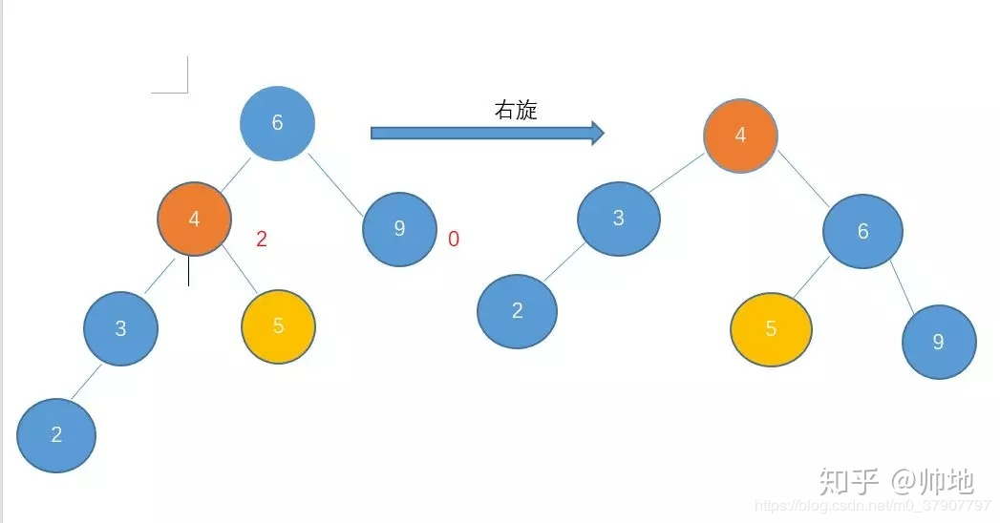
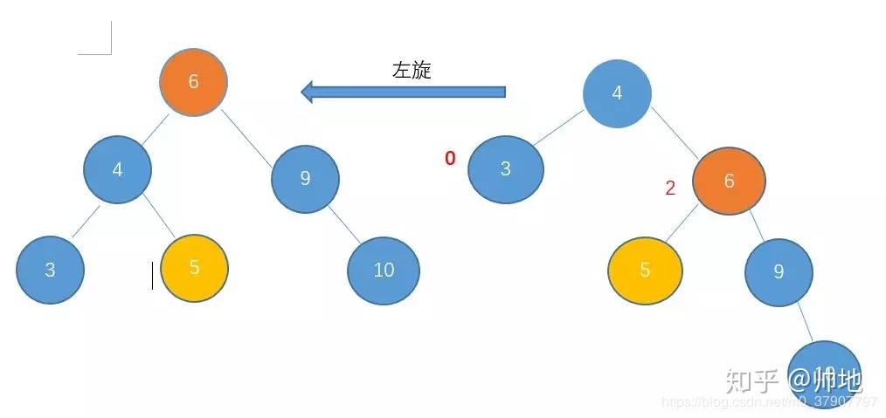
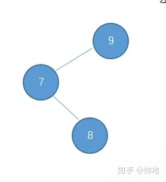
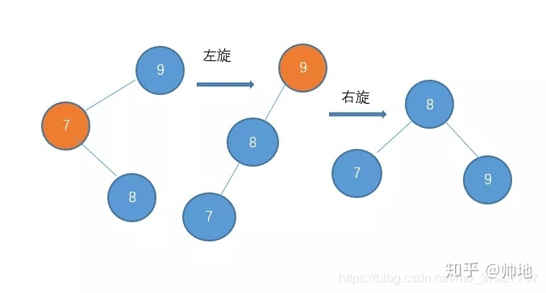
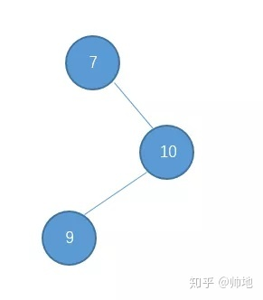
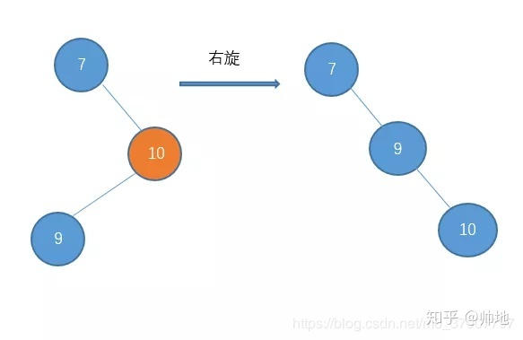
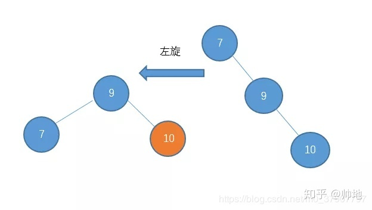

AVL 是建立在二叉查找树的基础之上的，因此要求我们对二叉排序树有明确的认知。

1. 左子树的所有元素都小于根节点
2. 右子树的所有元素都大于根节点
3. 左右子树都是二叉查找树

因此我们需要明确在旋转的过程中，要满足二叉查找树的性质，那么对于如何旋转就能有比较好的指导。

思考问题1： 

root---LR型的子树，那么Root节点与L、R节点元素的大小关系？

--->L肯定小于root，R肯定大于L。由于R属于root左子树的一部分，因此R也是小于root的。 同理，root---RL树中R与L肯定都大于root，R肯定大于L。因此将R节点右旋，得到一个RR型，然后再进行左旋。

**左左右旋**：解决大部分节点偏向左边的场景

右旋动图：

案例：

**左旋：就是用来解决当大部分节点都偏向右边的时候，通过左旋来还原**

动图：

案例：

**L-R型**

处理：

**R-L型：**

处理：

构建AVL：初始树3、2，插入元素1,4,5,6,7,10,9,8。

​     		3 

   		/      

​		2   

​	/           

1

